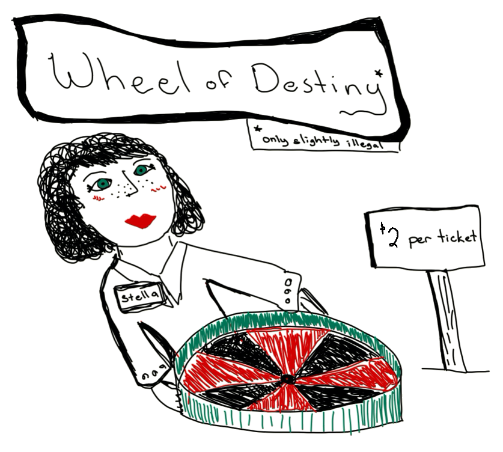
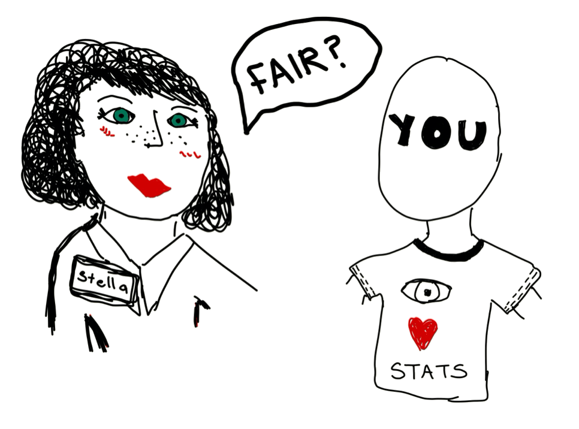
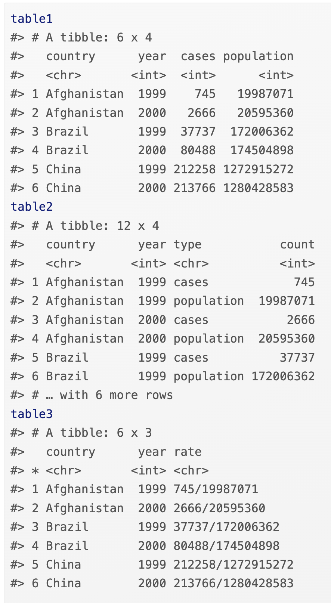

#### Today's agenda (5 min):  

- Q&A/vocabulary list

- Group Discussion

- Writing prompt

#### This Week's Vocab (15-20 min) :  

- Cleaning data
- Tidy data
- Removing a column
- Extracting a subset of variables
- Filtering a tibble based on a condition (e.g. based on the values in one or more of the variables/columns)
- Sorting data based on the values of a variable
- Renaming the variables
- Grouping categories
- Defining new variables
- Producing new data frames
- Handling missing values (NAs)
- Creating summary tables

#### Data wrangling with R (20 min) : 

- `dplyr` functions: select(),filter(), arrange(), desc(), mutate(), summarise(), groupby(), is.na(), and na.rm=TRUE
- data summary: mean(), min(), max(), median(), IQR(), range(), quantile(), var(), sd(), n(), sum()

For functions above, you may want to present the ideas through:
- an R demo with the Olympics Dataset
- going through questions from [*Week2*](https://q.utoronto.ca/courses/277998/quizzes/279235) and [Week3](https://q.utoronto.ca/courses/277998/quizzes/279236) practice quizzes
- come up with your own quiz (e.g. on Kahoot!)

#### Plagarism & Paraphrasing (25-30 min) :  

- *Must Do* Discuss the plagarism video in R homework.(If the majority of the students didn't watch, play the video on projector). Some questions to ask
  - What are the 6 most common types of plagarism?
  - What is unexpected to you from the video or what have you learned from this video?
  - Did you see any behavior of others that could've been counted as plagarism? How would you correct them/help them avoid plagarism?
  
  
- *If time* Paraphrasing discussion (on separate handout)
  - Ask students to paraphrase the Bach's Oboe example.
  - Invite some students to share their work in groups.
  - Show the 3 paraphrasing example and ask students to select the best one after group discussion.(If time is limited, only do this excercise and skip the previous two.)


#### Discussion (20-25 min) :  

- *Must Do* Wheel of Destiny

Stella McStat had been running a small-time gambling operation on campus for several months during her first year at U of T. It was disrupted during COVID, but now that vaccines are mandatory to be on campus, Stella is getting things back up and running.

```{r plot2, echo=FALSE, fig.align='center', out.width = "40%",fig.pos="H", fig.cap = "Adapted from Lawton, L. (2009) An Exercise for Illustrating the Logic of Hypothesis Testing, Journal of Stat. Education, 17(2)."}

```   

The format: For each spin of the wheel, two gamblers take part. For a toonie each ($2 Canadian), Stella sells one a red ticket and one a black ticket  (i.e., total $4). Then Stella spins the Wheel of Destiny. The person who holds the colour on which the spinner stops gets $3.50 (Stella keeps $0.50 per spin for running the game and providing snacks).

Stella just bought a new spinner, the critical piece of equipment for this game. She's heard some mixed reviews about the manufacturer she has purchased from. Before she beings using this spinner, she wants to make sure that it is, in fact, fair—she wants both colours to come up equally often. Because of the set-up of the game, Stella has no incentive to cheat and wants the game to be as fair as possible.

Everything she can examine about the wheel seems fine; there is the same number of sectors of each colour and they each have the same area. BUT! Stella has a great idea and decides to come to YOU, her statistical guru, and ask you to verify that the new spinner is fit to use.

```{r plot3, echo=FALSE, fig.align='center', out.width = "40%",fig.pos="H", fig.cap = "Adapted from Lawton, L. (2009) An Exercise for Illustrating the Logic of Hypothesis Testing, Journal of Stat. Education, 17(2)."}

```   
1. Describe a procedure for testing the spinner. Assume you could have physical access to Stella's spinner (while maintaining physical distancing). The procedure should be statistical in nature, i.e. not taking apart the spinner and checking the construction, etc. It should also be possible for you to actually do the testing procedure, e.g., no "do x infinite times".

2. Describe criteria you could set for results from your test under which you would be:

i) fairly sure the spinner is fair,
ii) fairly sure the spinner is NOT fair, and
iii) when you wouldn't be willing to give Stella a decision either way.

- *If time* What are the three interrelated rules that make a dataset tidy? 
  <!-- - Each variable must have its own column. -->
  <!-- - Each observation must have its own row. -->
  <!-- - Each value must have its own cell. -->
  
{width=75%}

<!-- - Are these data below tidy? Why or why not? If not, how to make them tidy? -->
<!--  -->

- Why is data visualization so important?

- Why does your audience matter? (Think about what message you want to portray and the types of data/ visualizations that you’ll use)

- Why is it important for data visualizations to be intuitive? How can you ensure your figures are intuitive to the intended audience?

- What might happen to a data visualization project if you failed to clean the data?

\newpage

#### Writing prompt (30 min) :  

In your homework, you provided some visualizations, summaries, and discussion about the ages of the 2012 Olympic athletes for your boss.  From the perspective of the message and the audience, compare and contrast graphical visualizations and tabular summaries in terms of their strengths and weaknesses, and under what circumstances each of these might be the most appropriate and why. Comment on the relevance of data cleaning and data wrangling for graphical visualizations and tabular summaries.


### Important Features to Include


-	Start off with a small introduction. You should include 1 or 2 sentences to draw your reader in, and then explain what you will be discussing. 
-	You want to show off all the knowledge you gained in STA130 so you must include at least 2 vocabulary words. However, they should be understandable to non-statisticians, therefore you must define any vocabulary terms you used.
- Think about what message you want to portray and why it matters to use different types of data/ visualizations with the audience in mind.


### Some general reminders 

-	Try to not spend more than 20 minutes on the prompt.
-	Aim for more than 200 words but less than 400 words.
-	Use full sentences.
-	Grammar is not the main focus of the assessment, but it is important that you communicate in a clear and professional manner. Remember, this is meant to be a small report to your boss! So you should not include any slang or emojis. 
-	Remember that you have only conducted a preliminary analysis and therefore you may not have a definitive answer. That is totally ok! It is hard to ever say something is 100% one way or another. Therefore, you will want to try to incorporate some hedging language into your writing. You can find more information about hedging in a short video here: [https://q.utoronto.ca/courses/277998/pages/writing-skills-videos-week-3-problem-set](https://q.utoronto.ca/courses/277998/pages/writing-skills-videos-week-3-problem-set)


 

## Vocabulary 

- Cleaning data
- Tidy data
- Removing a column
- Extracting a subset of variables
- Filtering a tibble based on a condition (e.g. based on the values in one or more of the variables/columns)
- Sorting data based on the values of a variable
- Renaming the variables
- Grouping categories
- Defining new variables
- Producing new data frames
- Handling missing values (NAs)
- Creating summary tables

*You may also find these vocabulary words from last week useful with your writing this week*

- Where are the data centered (towards the left, right, middle) 
- How much spread (relative to what?) 
- Shape: symmetric, left-skewed, right-skewed 
- The tails of the distribution (heavy-tailed or thin-tailed) 
- Modes: where, how many, unimodal, bimodal, multimodal, uniform 
- Outliers, extreme values
- Frequency (which category occurred the most or least often; data concentrated near a particular value or category) 
- Mean (average), median, mode 
- standard deviation, interquartile range 


